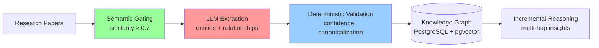

# AI Research Discovery Agent

> Entity-first knowledge graphs from research papers with explainable provenance

**Quick Links**: [Live](https://research-agent-eta.vercel.app) · [Architecture](docs/SYSTEM_ARCHITECTURE_OVERVIEW.md) · [Example Queries](sql/queries.sql) · [OSS Launch Checklist](docs/LAUNCH_OSS_CHECKLIST.md) · [Contributing](CONTRIBUTING.md)

**OSS**: You can download, run locally, contribute (PRs/issues), and use **bring-your-own-key** (BYOK) so the host doesn’t need to provide API keys. The app stays hosted at the current site; Stripe or shared keys may be added later if there’s enough demand.

**Example corpus**: 46 papers → 228 entities → 267 relationships with evidence

This project extracts semantic relationships (e.g., "Method A improves on Method B") from research papers and builds a queryable knowledge graph—where every claim is traceable to specific evidence in the source material.

**The challenge**: Academic papers encode rich semantic claims, but those claims aren't structured for discovery, comparison, or reasoning.

In fast-moving domains such as computer vision, researchers face three fundamental challenges:

- **Information Overload**  
  In fields like neural rendering, 50+ papers are published monthly. A researcher trying to track "improvements on NeRF" must manually read abstracts, scan related work sections, and cross-reference citations—a process that doesn't scale beyond ~20 papers.

- **Implicit Structure**  
  Claims like "our method outperforms 3D Gaussian Splatting by 2x" are buried in prose. There's no queryable structure to answer "which papers improve on method X?" without reading every paper. Citation graphs show connections but not *why* papers are related.

- **Low-Trust Automation**  
  Vector search and "Chat with PDF" tools surface relevant papers quickly, but they hallucinate relationships, miss explicit claims, and provide no audit trail. You can't verify "Paper A improves on Method B" without manually checking the source—defeating the purpose of automation.

A system that merely retrieves or summarizes papers is insufficient. To support real research discovery, the output must be **structured, auditable, and trustworthy at scale**.

---

## Design Thesis

This system is built around a simple principle:

**Use LLMs for probabilistic extraction, but never for authority.**

Large Language Models are well suited to reading messy, unstructured text and proposing candidate entities and relationships. However, they are non-deterministic, susceptible to hallucination, and unreliable at enforcing global constraints such as graph topology.

To address this, the architecture deliberately separates concerns:

- **Probabilistic Extraction**  
  Stateless LLM agents (Gemini 1.5 Pro / Flash) identify candidate entities and semantic relationships from paper text.

- **Deterministic Validation**  
  All extracted data is treated as untrusted input. Strict, code-based validation logic enforces canonicalization, confidence thresholds, structural invariants, and provenance before any mutation of the graph.

This separation allows the system to scale ingestion while preserving correctness, explainability, and long-term maintainability.

---

## What the System Does

At a high level, the system operates as a bounded pipeline:

- **Semantic Gating**  
  Candidate papers are embedded and strictly gated based on cosine similarity to a seed paper, ensuring compute is only spent on relevant literature.

- **Structured Extraction**  
  Specialized agents extract entities (Methods, Concepts, Datasets, Metrics) and relationships using a fixed, strictly typed vocabulary (e.g., `improves_on`, `extends`).

- **Safety & Persistence**  
  Deterministic rules reject low-confidence edges, penalize orphan entities, and catch self-references before persisting validated data to a Postgres graph schema.

- **Incremental Reasoning**  
  An optional reasoning agent identifies multi-hop insights over bounded subgraphs, ensuring explainability without unbounded cost growth.

## Architecture at a Glance



**Key principle**: LLMs propose, code enforces.

---

## Corpus Selection

Papers are selected using a two-phase strategy:
1. **Multi-source retrieval:** Gather ~500-1000 candidates from Semantic Scholar (citations, references, keywords) and arXiv (title, author, category searches)
2. **Semantic gating:** Embed all candidates, compute cosine similarity to the seed paper, filter to similarity ≥ 0.7, select top 100

This ensures only semantically relevant papers consume expensive LLM extraction resources, reducing costs by ~80% compared to processing all citations.

**Seed paper:** "3D Gaussian Splatting for Real-Time Radiance Field Rendering" (Kerbl et al., 2023)

## Results


Processed 46 papers from the Gaussian Splatting domain, extracting:
- **228 entities** (102 Methods, 38 Concepts, 28 Datasets, 21 Metrics)
- **267 relationships** (improves_on, uses, evaluates, introduces, extends, compares_to)
- **60 inferred insights** via multi-hop reasoning

**Validation rates:**
- **98% entity approval rate**: Nearly all extracted entities pass confidence and structural validation. The 2% rejection rate primarily catches low-confidence mentions or duplicates.
- **76% edge approval rate**: This is **intentional by design**. The system rejects edges below 0.6 confidence to prioritize precision over recall. Lower-confidence relationships are flagged for review rather than discarded, preserving them for human validation. This conservative approach prevents false positives that would corrupt the graph.

---

## Design Highlights

This system makes several architectural decisions that distinguish it from naive LLM-based extraction:

### Two-Tier Entity Resolution

Papers refer to the same method in dozens of ways: "3D Gaussian Splatting", "3DGS", "3d_gaussian_splatting", "Gaussian Splatting 3D".

Instead of destructively merging these variants (which breaks if you make a mistake), we use reversible `alias_of` links:

- **Tier A**: Exact matches (deterministic, zero false positives)
- **Tier B**: Semantic similarity with strict auto-approval rules (≥0.95 similarity + shared aliases)
- **Query-time resolution**: Views provide canonical names while preserving original node IDs

**Why this matters**: False merges are catastrophic—"Attention (deep learning)" and "Attention (psychology)" are not the same. Link-based canonicalization lets you audit and reverse every decision.

---

## Using the App

- **Graph**: Force-directed knowledge graph of entities (methods, concepts, datasets, metrics) and relationships. Click a node for the entity panel; click an edge for relationship details and evidence. The graph locks after the layout settles so you can select without dragging. Multiple relationships between the same pair of nodes are drawn in parallel.
- **Run**: Submit a paper (arXiv search, URL, file, or paste). The pipeline extracts entities and relationships, then runs optional reasoning to produce multi-hop insights. After a run, the graph refreshes automatically.
- **Insights**: Lists inferred insights (transitive relationships, gaps, trends) from the pipeline’s reasoning step. Data is loaded from `GET /api/insights` (tenant-scoped). If the tab is empty, run at least one paper through the pipeline so reasoning can populate the `inferred_insights` table.
- **Settings**: Workspace settings, reasoning depth (Quick / Standard / Deep / Rigorous), semantic threshold, speculative edges, cost/token limits, and BYOK API key.
- **Review**: Queue of flagged entities and edges for approval or rejection.
- **Search**: Full-text and semantic search over entities and papers.
- **Entity panel**: Click a node to see details, confidence, connected papers (from entity_mentions and edge provenance), relationships, and an “In context” snippet from the first edge evidence.
- **Edge modal**: Relationship type, confidence, evidence quote, provenance, and related insights.

Full setup (DB migrations, BYOK, deployment) is in [docs/LAUNCH_OSS_CHECKLIST.md](docs/LAUNCH_OSS_CHECKLIST.md).

## Try It Locally

1. **Backend**: `cp env.example .env`, set `GOOGLE_API_KEY`, Supabase URL and keys (`SUPABASE_URL`, `SUPABASE_ANON_KEY` for sign-in; optional `SUPABASE_SERVICE_ROLE_KEY`), then `npm install` and `npm run api:run` (API at `http://localhost:3000`).
2. **Frontend**: In `frontend/`, create `frontend/.env` with `VITE_API_URL=http://localhost:3000` and your Supabase URL and anon key (for sign-in). Optionally set `VITE_USE_MOCK=false` if you want to force real API; when `VITE_API_URL` is set, the app uses the API by default. Then `npm install` and `npm run dev` (app at `http://localhost:5173`).
3. Sign in, pick a workspace, then use **Run** → **Search arXiv** (or URL/file) to run the pipeline on a paper. After ingestion and reasoning, the graph and **Insights** tab will populate.

## Environment (sign-in / 401 fix)

For sign-in and Bearer auth to work, the **API** `.env` must have:

- **SUPABASE_URL** – Supabase project URL (Dashboard → Project Settings → API)
- **SUPABASE_ANON_KEY** – anon (public) key from the same API page (used to validate JWTs)

If either is missing, the API will return 401 and you’ll see “Session invalid or expired. Please sign in again.” The API logs a warning at startup if `SUPABASE_ANON_KEY` is not set. You can use `SUPABASE_SERVICE_ROLE_KEY` instead of `SUPABASE_ANON_KEY` for JWT validation if you prefer.

The frontend needs **VITE_API_URL** and Supabase keys in `frontend/.env` so it can call the API and Supabase Auth. If **Insights** (or other tenant-scoped data) doesn’t load, ensure you’re signed in and a workspace is selected; insights appear after running papers through the pipeline (reasoning step).

## Database Migrations (Supabase)

SQL migrations live in `src/db/migrations/`. Supabase does not allow raw SQL execution via the service role API, so apply these manually:

1. Open the Supabase SQL editor.
2. Run each migration file in order.

To list migrations (and optionally print SQL):

```
npm run migrations:sql
# or
npm run migrations:sql -- --print
```

### Evidence-First Schema

Every relationship edge requires:
- Verbatim evidence quote (max 300 characters) from the source paper
- Provenance metadata (section ID, part index, paper ID)
- Confidence score validated against thresholds

This enables auditability: every claim can be traced to a specific sentence in a specific paper.

### Persistent Embeddings via pgvector

- Paper embeddings stored in PostgreSQL (3072 dimensions)
- Entity embeddings use dual storage: 3072-dim raw for precision, 768-dim indexed with HNSW for fast search
- Semantic gating reuses stored embeddings, reducing API calls by ~80% for papers already processed

### Incremental Reasoning

Rather than reasoning over the entire graph, the system:
- Builds depth-2 subgraphs around newly ingested papers
- Caches graph snapshots to avoid redundant reasoning
- Generates insights only over affected regions

This keeps reasoning cost bounded as the corpus grows from 100 to 10,000+ papers.

---

## Example SQL Queries

The system produces a queryable knowledge graph. Here's how to answer a common research question:

> **Research Question:** *Which papers improve on the original 3D Gaussian Splatting method?*

This query finds all `improves_on` relationships where 3D Gaussian Splatting is the target, ordered by confidence and year:

```sql
SELECT DISTINCT 
  p.paper_id,
  p.title,
  p.year,
  e.confidence, 
  e.evidence,
  source_node.canonical_name AS source_entity,
  source_node.type AS source_type
FROM edges e
JOIN nodes target_node ON e.target_node_id = target_node.id
JOIN nodes source_node ON e.source_node_id = source_node.id
LEFT JOIN papers p ON p.paper_id = e.provenance->'meta'->>'source_paper_id'
WHERE e.relationship_type = 'improves_on'
  AND target_node.canonical_name = '3d_gaussian_splatting'
  AND target_node.type = 'Method'
  AND e.confidence >= 0.6
  AND e.provenance->'meta'->>'source_paper_id' IS NOT NULL
ORDER BY e.confidence DESC, p.year DESC
LIMIT 10;
```

**Sample results:**
- GPS-Gaussian (confidence: 0.9) - "Quantitative comparisons against state-of-the-art generalizable methods..."
- 4D-Rotor Gaussian Splatting (confidence: 0.9) - Novel view synthesis improvements
- RDG-GS (confidence: 0.85) - "RDG-GS achieves state-of-the-art performance on Mip-NeRF360..."

**What this reveals**:
- **GPS-Gaussian** (0.9 confidence): A generalizable version that works across scenes
- **4D-Rotor GS** (0.9 confidence): Extension to dynamic/4D scenes
- **RDG-GS** (0.85 confidence): Improvement via depth guidance

These aren't just "papers that cite 3DGS"—they're papers that explicitly claim to *improve* on it, with evidence extracted from their experimental sections. This distinction (citation vs. claimed improvement) is what makes the graph useful for competitive analysis.

**More queries**: See [`sql/queries.sql`](sql/queries.sql) for transitive relationships (e.g., "what papers transitively build on NeRF?"), concept clusters, dataset usage patterns, and more.

---

## Tech Stack

### Core Infrastructure
- **Runtime:** Node.js / TypeScript
- **Database:** PostgreSQL (Supabase) with pgvector extension
- **API:** Fastify with tenant isolation

### AI & Embeddings
- **LLMs:** Google Gemini (e.g. 2.5 Pro / Flash; see `env.example` and `src/agents/config.ts`)
- **Embeddings:** `gemini-embedding-001` (3072 dimensions)
- **Vector Search:** pgvector for paper and entity similarity search

### Validation & Schema
- **Validation:** Zod schemas & custom TypeScript logic
- **Entity Resolution:** Two-tier system (exact match + semantic similarity with link-based canonicalization)

---

## Documentation Guide

This README provides a high-level orientation. Detailed architecture, validation logic, trade-offs, and diagrams are documented separately to keep this overview clean:

- **[SYSTEM_ARCHITECTURE_OVERVIEW.md](docs/SYSTEM_ARCHITECTURE_OVERVIEW.md)** 
- **[LIMITATIONS_AND_TRADEOFFS.md](docs/LIMITATIONS_AND_TRADEOFFS.md)**   
- **[DESIGN_RATIONALE.md](docs/DESIGN_RATIONALE.md)** 
- **[FUTURE_ROADMAP.md](docs/FUTURE_ROADMAP.md)** 

---

## Why This Matters

Most LLM-based research tools fail at scale because they treat the model as an authority. When you ask "which papers improve on NeRF?", you get a plausible answer but no way to verify it. If the model hallucinates a relationship or misses an explicit claim, you have no audit trail.

This system inverts that model: **LLMs propose, code enforces**.

Every relationship in the knowledge graph is:
- **Traceable**: Linked to verbatim evidence from the source paper
- **Validated**: Checked against confidence thresholds and structural rules
- **Reversible**: Entity canonicalization uses links, not destructive merges
- **Queryable**: Standard SQL queries answer research questions directly

The result is a system of record that researchers can trust. When the graph says "Paper A improves on Method B with 0.9 confidence", you can click through to the exact sentence in Paper A that makes that claim. This auditability is essential for research workflows where decisions must be defensible and reproducible.

### Concrete Example

Imagine you're a PhD student entering the 3D reconstruction space. You need to answer:

1. What are the foundational methods?
2. What are researchers currently improving?
3. Which datasets should I evaluate on?
4. Are there unexplored gaps?

**Traditional approach**: Read 50+ papers manually, build a mental model, hope you didn't miss anything critical.

**This system**: Run 4 SQL queries, get structured answers with evidence, identify the 12 papers you *must* read deeply. Time savings: weeks → hours.

**The trust guarantee**: When the graph says "GPS-Gaussian improves on 3DGS", you can click through to the exact sentence that makes that claim. No hallucinations, no summarization errors, no black boxes.

---

## What I Learned

Building this system surfaced several lessons about working with LLMs at scale:

**LLMs as unreliable components**: Treating LLM outputs as untrusted input and enforcing invariants in code (not prompts) was the key reliability win. The progressive degradation pattern (Normal → Compact → Minimal extraction modes) prevented pipeline failures without sacrificing correctness.

**Cost optimization is architecture**: Semantic gating reduced costs by 80% not through model choice, but by limiting what gets processed. This principle applies beyond research: any ML pipeline that processes large corpora should filter before expensive operations.

**Graph schema rigidity enables scale**: I initially considered letting agents dynamically create entity types. Enforcing a fixed ontology (Method, Concept, Dataset, Metric) was the right call—it enabled deterministic validation and prevented schema drift that would have fragmented the graph.

**Documentation as design tool**: Writing the design rationale document helped me identify edge cases I hadn't considered (e.g., handling papers that improve on multiple methods, orphan entity penalties).

---

## License

This project is licensed under the MIT License - see the [LICENSE](LICENSE) file for details.
