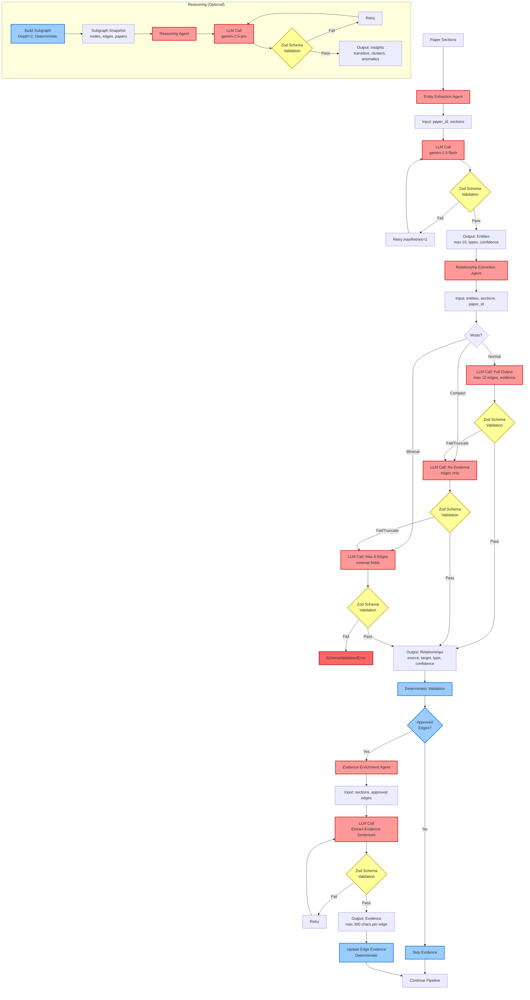
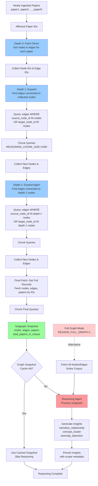

# System Architecture Overview

This system is designed to agentically analyze a corpus of research papers and construct a high-fidelity, explainable knowledge graph, while remaining robust to the failure modes inherent in large language models and external APIs.

Rather than treating LLMs as a monolithic reasoning engine, the architecture deliberately separates **probabilistic extraction** from **deterministic validation and persistence**, ensuring that correctness, scalability, and trustworthiness are preserved as the system grows.

---

## High-Level Data Flow

At a high level, the system operates as a staged pipeline:

1. Corpus discovery and retrieval  
2. Semantic similarity gating  
3. Paper ingestion and sectioning  
4. Entity extraction  
5. Relationship extraction  
6. Deterministic validation and canonicalization  
7. Graph persistence  
8. Incremental reasoning and insight generation  

Each stage is independently bounded, cacheable, and failure-isolated.

---

## End-to-End Pipeline

### Diagram: End-to-End Pipeline Flow

```mermaid
flowchart TD
Seed[Seed Paper Input] --> Retrieval[Multi-Source Retrieval]
    
    Retrieval --> SS[Semantic Scholar API<br/>Citations, References, Keywords]
    Retrieval --> Arxiv[arXiv API<br/>Title Search, Category Queries]
    
    SS --> Dedup[Candidate Deduplication]
    Arxiv --> Dedup
    
    Dedup --> Gate[Semantic Gating]
    Gate --> Embed[Embedding Computation<br/>gemini-embedding-001]
    Embed --> Cosine[Cosine Similarity<br/>Threshold >= 0.7]
    Cosine --> Select[Rank & Select<br/>Top 100 Papers]
    
    Select --> Download[PDF Download]
    Download --> Check{Paper Exists?}
    Check -->|Yes| Skip[Skip Pipeline]
    Check -->|No| Ingest[Ingestion Agent<br/>LLM: Extract Sections]
    
    Ingest --> Cache1{Section Cache?}
    Cache1 -->|Hit| Sections[Sections from Cache]
    Cache1 -->|Miss| IngestLLM[LLM Call]
    IngestLLM --> Sections
    
    Sections --> PersistSections[Persist Sections<br/>Deterministic]
    PersistSections --> Entity[Entity Extraction Agent<br/>LLM: Extract Entities]
    
    Entity --> Cache2{Entity Cache?}
    Cache2 -->|Hit| Entities[Entities from Cache]
    Cache2 -->|Miss| EntityLLM[LLM Call]
    EntityLLM --> Entities
    
    Entities --> RelCore[Relationship Core Agent<br/>LLM: Extract Relationships]
    RelCore --> Cache3{Relationship Cache?}
    Cache3 -->|Hit| Relationships[Relationships from Cache]
    Cache3 -->|Miss| RelLLM[LLM Call]
    RelLLM --> Relationships
    
    Relationships --> Validate[Validation<br/>Deterministic Rules]
    Validate --> EntityVal[Entity Validation<br/>Confidence, Orphan, Duplicate]
    Validate --> EdgeVal[Edge Validation<br/>Self-Ref, Confidence]
    
    EntityVal --> PersistEntities[Persist Entities<br/>Batch Deduplication]
    EdgeVal --> PersistEdges[Persist Edges<br/>Batch Insert]
    
    PersistEdges --> Evidence{Approved Edges?}
    Evidence -->|Yes| RelEvidence[Evidence Enrichment Agent<br/>LLM: Extract Evidence]
    Evidence -->|No| SkipEvidence[Skip Evidence]
    RelEvidence --> UpdateEvidence[Update Edge Evidence<br/>Deterministic]
    
    UpdateEvidence --> Reasoning{Reasoning Enabled?}
    SkipEvidence --> Reasoning
    Reasoning -->|No| End[Pipeline Complete]
    Reasoning -->|Yes| Subgraph[Build Subgraph<br/>Depth=2, Deterministic]
    Subgraph --> Cache4{Graph Snapshot Cache?}
    Cache4 -->|Hit| Snapshot[Snapshot from Cache]
    Cache4 -->|Miss| BuildSnapshot[Build Snapshot]
    BuildSnapshot --> Snapshot
    
    Snapshot --> ReasonAgent[Reasoning Agent<br/>LLM: Generate Insights]
    ReasonAgent --> PersistInsights[Persist Insights<br/>Deterministic]
    PersistInsights --> End
    
    classDef llm fill:#ff9999,stroke:#cc0000,stroke-width:2px
    classDef deterministic fill:#99ccff,stroke:#0066cc,stroke-width:2px
    classDef cache fill:#ffff99,stroke:#cc9900,stroke-width:2px,stroke-dasharray: 5 5
    
    class Ingest,Entity,RelCore,RelEvidence,ReasonAgent,IngestLLM,EntityLLM,RelLLM llm
    class PersistSections,Validate,EntityVal,EdgeVal,PersistEntities,PersistEdges,UpdateEvidence,Subgraph,PersistInsights,Check,Select,Embed,Cosine,Dedup,Download deterministic
    class Cache1,Cache2,Cache3,Cache4 cache
```    



This diagram illustrates the complete lifecycle of a paper, from seed selection through reasoning. It visually distinguishes:

- Retrieval vs decision-making stages  
- LLM-based components vs deterministic components  
- Cache boundaries and retry paths  

Critically, **semantic similarity gating occurs before any expensive ingestion or extraction**, ensuring downstream compute is reserved for papers that are meaningfully related to the seed topic.

---

## Corpus Discovery and Semantic Gating

### Retrieval Phase (Non-Blocking)

Candidate papers are retrieved from multiple sources:

- Semantic Scholar (citations, references, keyword search)
- arXiv API (title and keyword search)

Retrieval is opportunistic and resilient. Failures in any single source do not block the pipeline. Candidates from all sources are aggregated and deduplicated by stable identifiers.

This phase prioritizes **recall**, not precision.

### Semantic Gating Phase (Authoritative)

All retrieved candidates pass through a mandatory **semantic similarity gating** stage:

- The seed paper’s title and abstract are embedded
- Candidate paper titles and abstracts are embedded
- Cosine similarity is computed
- Candidates below a configurable similarity threshold are discarded
- Top-K papers are selected under strict upper bounds

This design ensures the system can truthfully state:

> “Paper ingestion is gated by semantic similarity, independent of retrieval source availability.”

### Diagram: Semantic Discovery & Gating

```mermaid
flowchart LR
    Seed[Seed Paper<br/>Title + Abstract] --> Norm1[Normalize Text<br/>title + abstract]
    
    subgraph Retrieval["Multi-Source Retrieval (Parallel, Non-Blocking)"]
        SS[Semantic Scholar<br/>Citations: 100<br/>References: 100<br/>Keywords: 60×4]
        Arxiv[arXiv<br/>Title: 60<br/>Categories: 60×4]
    end
    
    SS --> Merge[Merge & Deduplicate<br/>By paperId/arxivId]
    Arxiv --> Merge
    
    Merge --> Candidates[~500-1000 Candidates]
    Candidates --> Cap{Candidates > 500?}
    Cap -->|Yes| Slice[Slice to 500<br/>maxCandidatesToEmbed]
    Cap -->|No| Pass[Pass All]
    
    Slice --> EmbedCandidates
    Pass --> EmbedCandidates[Embed Candidates<br/>Batch Size: 32]
    
    Norm1 --> EmbedSeed[Embed Seed<br/>gemini-embedding-001]
    EmbedSeed --> SeedVec[Seed Vector]
    EmbedCandidates --> CandVecs[Candidate Vectors]
    
    SeedVec --> Cosine[Cosine Similarity<br/>Compute for Each Candidate]
    CandVecs --> Cosine
    
    Cosine --> Similarities[Similarity Scores<br/>Range: 0.0-1.0]
    Similarities --> Filter{Similarity >= 0.7?}
    
    Filter -->|No| Reject[Reject Paper<br/>Below Threshold]
    Filter -->|Yes| PassThreshold[Pass Threshold]
    
    PassThreshold --> Rank[Rank by Similarity<br/>Descending]
    Rank --> Top100[Select Top 100<br/>maxSelectedPapers]
    
    Top100 --> Selected[Selected Papers<br/>Ready for Ingestion]
    
    Reject -.->|Discarded| Discard[Not Processed]
    
    classDef semantic fill:#99ff99,stroke:#006600,stroke-width:3px
    classDef retrieval fill:#ffcc99,stroke:#cc6600,stroke-width:2px
    classDef gate fill:#ff9999,stroke:#cc0000,stroke-width:2px
    
    class EmbedSeed,EmbedCandidates,Cosine,Similarities,Filter,Rank semantic
    class SS,Arxiv,Merge,Candidates retrieval
    class Top100,Selected,Reject gate
```



This diagram makes explicit that **retrieval source quality does not determine inclusion — semantic similarity does**.

---

## Ingestion and Sectioning

Once a paper passes semantic gating:

- PDFs are downloaded (if available)
- Text is extracted and normalized
- Sections are identified using a deterministic sectionizer with fallback logic
- Input size is strictly bounded to prevent runaway prompt growth

If a paper already exists in the database, ingestion is skipped unless explicitly forced.

---

## Agent-Based Extraction

The system uses specialized, stateless agents for probabilistic extraction tasks.

### Entity Extraction Agent

- Identifies concepts such as methods, datasets, metrics, and tasks
- Produces structured outputs with confidence scores
- Operates independently per section for parallelism

### Relationship Extraction Agent

- Extracts directed semantic relationships (e.g., *introduces*, *improves_on*, *evaluates*)
- Associates each relationship with textual evidence
- Uses **progressive degradation** modes to guarantee completion under truncation pressure

### Diagram: Agent Interaction & Safety



This diagram highlights:

- Stateless agent design  
- Schema enforcement boundaries  
- Progressive degradation (normal → compact → minimal)  
- Retry and failure isolation  

LLM output is treated as **untrusted input** until validated.

---

## Deterministic Validation and Canonicalization

All agent outputs pass through deterministic validation logic implemented in TypeScript.

Validation enforces invariants such as:

- Canonical entity identity
- Confidence thresholds
- Duplicate and self-edge rejection
- Structural schema correctness

Entities and edges may be **approved**, **flagged for review**, or **rejected outright**, but invalid data is never persisted silently.

```mermaid
flowchart TD
Diagram: Validation & Persistence

    Entities[Extracted Entities] --> Canon1[Canonicalize Names<br/>lowercase, normalize]
    Edges[Extracted Edges] --> Canon2[Canonicalize Source/Target]
    
    Canon1 --> EntityRules[Entity Validation Rules]
    Canon2 --> EdgeRules[Edge Validation Rules]
    
    EntityRules --> ConfCheck1{Confidence<br/>Check}
    ConfCheck1 -->|>= 0.6| Approved1[Approved]
    ConfCheck1 -->|0.3-0.6| Flagged1[Flagged]
    ConfCheck1 -->|< 0.3| Rejected1[Rejected]
    
    Approved1 --> OrphanCheck{Orphan?<br/>Single Mention}
    OrphanCheck -->|Yes| OrphanPenalty[Confidence × 0.5]
    OrphanPenalty --> OrphanRecheck{Adjusted<br/>>= 0.6?}
    OrphanRecheck -->|Yes| Approved1
    OrphanRecheck -->|No| Flagged1
    
    Approved1 --> DupCheck[Duplicate Detection<br/>Levenshtein < 3]
    DupCheck -->|Found| Flagged1
    DupCheck -->|Not Found| Approved1
    
    EdgeRules --> SelfRef{Self-Reference?<br/>source == target}
    SelfRef -->|Yes| Rejected2[Rejected]
    SelfRef -->|No| ConfCheck2{Confidence<br/>Check}
    ConfCheck2 -->|>= 0.6| Approved2[Approved]
    ConfCheck2 -->|0.3-0.6| Flagged2[Flagged]
    ConfCheck2 -->|< 0.3| Rejected2
    
    Approved1 --> BatchLookup[Batch Lookup Existing Nodes<br/>by canonical_name, type]
    Flagged1 --> BatchLookup
    
    BatchLookup --> Exists{Node<br/>Exists?}
    Exists -->|Yes| LinkMention[Link to Existing Node<br/>Create entity_mention]
    Exists -->|No| BatchInsert[Batch Insert New Nodes]
    
    BatchInsert --> LinkMention
    LinkMention --> BatchMentions[Batch Insert<br/>entity_mentions]
    
    Approved2 --> BatchEdges[Batch Insert Edges<br/>Initially without evidence]
    Flagged2 --> BatchEdges
    
    BatchEdges --> EdgeMap[Edge ID Map]
    EdgeMap --> EvidenceUpdate[Update Evidence<br/>For approved edges only]
    
    Rejected1 -.->|Discarded| Discard1[Not Persisted]
    Rejected2 -.->|Discarded| Discard2[Not Persisted]
    
    BatchMentions --> DB[(Postgres Database)]
    EvidenceUpdate --> DB
    
    classDef validation fill:#99ccff,stroke:#0066cc,stroke-width:2px
    classDef persistence fill:#99ff99,stroke:#006600,stroke-width:2px
    classDef rejected fill:#ffcccc,stroke:#cc0000,stroke-width:2px
    
    class Canon1,Canon2,EntityRules,EdgeRules,ConfCheck1,ConfCheck2,OrphanCheck,OrphanPenalty,DupCheck,SelfRef validation
    class BatchLookup,BatchInsert,LinkMention,BatchMentions,BatchEdges,EvidenceUpdate,DB persistence
    class Rejected1,Rejected2,Discard1,Discard2 rejected
```

This diagram makes trust boundaries explicit: probabilistic extraction is always followed by deterministic enforcement before graph mutation.

---

## Graph Persistence

Validated data is persisted to a Postgres database using a graph-like schema:

- Papers
- Nodes (entities)
- Edges (relationships)
- Evidence and provenance
- Insights

All inserts are batched and idempotent. Re-ingesting the same paper does not corrupt the graph.

---

## Incremental Reasoning and Insight Generation

Rather than reasoning over the entire graph on every update, the system performs **incremental reasoning**:

- Newly ingested papers are identified
- An induced subgraph is constructed (depth-bounded)
- Reasoning runs only over affected nodes and edges
- Insights are persisted with graph snapshot identifiers

### Diagram: Incremental Reasoning Scope



This design preserves explainability while preventing quadratic growth in reasoning cost.

---

## Architectural Principles

This architecture is guided by a small set of first-principles constraints:

- Semantic relevance before scale  
- Probabilistic extraction, deterministic enforcement  
- Failure isolation over best-effort recovery  
- Bounded execution at every stage  
- Explainability as a first-class output  

These principles ensure the system remains reliable, extensible, and intelligible as the corpus grows.

---

## Scope Note

This architecture is intentionally backend-focused. While it supports rich graph exploration and explainable insights, frontend and visualization layers are treated as future work and kept separate from core ingestion and reasoning concerns.

